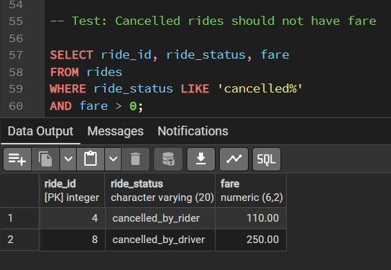

## Uber Ride Marketplace QA Data Validation (SQL)

This project simulates backend data validation for a ride-sharing system similar to Uber.

The goal is to validate business rules using SQL queries and detect potential defects in ride marketplace data.

## Tech Stack

* PostgreSQL
* SQL
* QA Data Validation

## Database Tables

* drivers
* riders
* rides

## Validation Test Scenarios

## Test Case 1: Cancelled Ride Fare Validation

Business Rule:
Cancelled rides should not charge a fare.

SQL Query:

SELECT ride_id, ride_status, fare
FROM rides
WHERE ride_status LIKE 'cancelled%'
AND fare > 0;

Result:
A defect was detected where a cancelled ride still had a fare charged.

Example:

ride_id: 4
ride_status: cancelled_by_rider
fare: 110

Expected: fare should be 0 or NULL

Actual: fare = 110

Impact: Potential incorrect billing to customer.

---

## Other Validation Checks

* Detect rides referencing non-existent drivers
* Detect invalid ride distances
* Validate payment methods
* Detect duplicate ride records
* Validate driver rating range
* Validate completed rides contain fare
* Detect rides referencing missing riders
* Validate driver join date

## QA Validation Summary

Total SQL Validation Queries Executed: 10
Passed: 9
Failed: 1

The failure detected a billing logic defect for cancelled rides.
